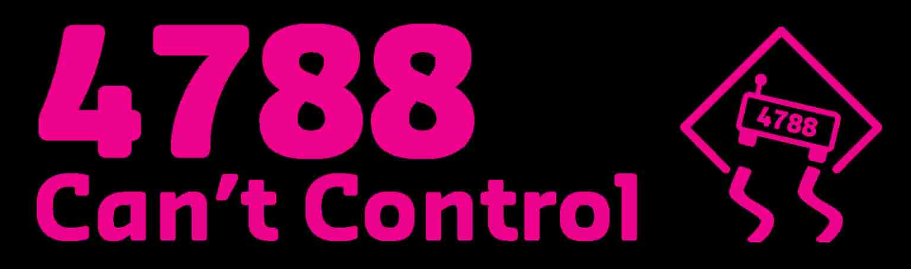

# Team 4788, Can't Control

## Who are we?
We are a community First Robotics Competition team based out of Curtin University from Western Australia (WA). Founded in 2013 we were the very first First team in WA and have started a variety of First programs here in WA. Along with ths we have also competed very succesfully in FRC for many years. Most Recently in 2023 we began competing at regionals again after COVID and won the Impact award sending us to Champs. 

## Socials
[Facebook](https://www.facebook.com/Team4788)  

[Instagram](https://www.instagram.com/frcteam4788/)  

[Youtube](https://www.youtube.com/@CurtinFRC4788CantControl)  
<!---
[Website](4788.team)
-->
